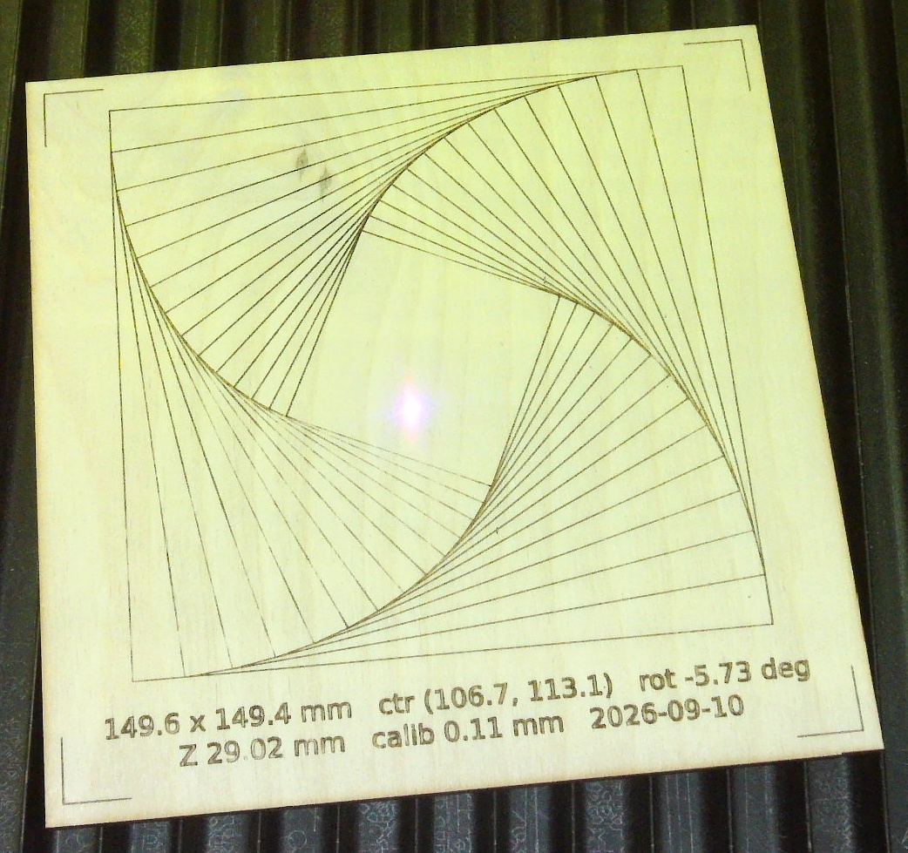
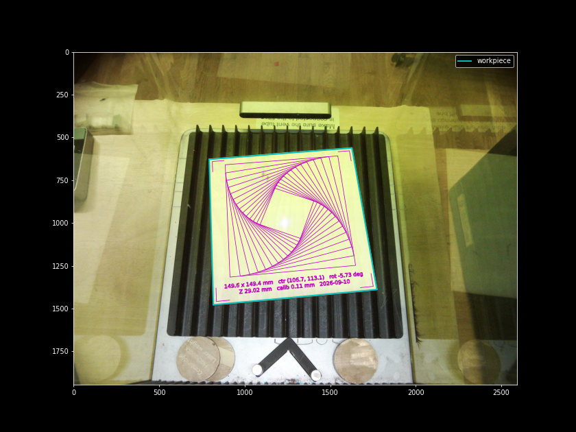

# cv_alignment_f1_ultra

> **Heads up: this is all vibe code.** It was written by Claude Code in one session, driving a
> real F1 Ultra over the LAN and iterating until the engravings lined up. It works on one machine,
> one firmware, one plywood square. You do not need to read any of it; run the commands below and
> look at what comes out on the wood.

Camera-based workpiece alignment for the xTool F1 Ultra over its LAN API,
plus a Python driver for the "V2" protocol that newer firmware (>= 40.52) uses.

Tested on firmware `40.52.016.2020.01.ht5` (device code GS002).

## Result

`python align.py test` on a 150 mm plywood square dropped onto the bed at a random angle:



The outer square of the whirl and the corner brackets follow the wood's edges; the text is the
tool's own measurement of the piece (149.6 x 149.4 mm, rotated -5.73 deg, focus at Z 29.02 mm,
calibration residual 0.11 mm). The plan as the camera saw it before burning:



## What's here

| File | Purpose |
|---|---|
| `F1_ultra_driver.py` | LAN driver: TLS WebSocket on port 28900, CRC16 framed JSON, file transfer, camera snapshot, job upload/start, Z move, autofocus. Also builds `.xf` job packages from G-code. |
| `align.py` | CV tool: photograph the bed, segment the workpiece, calibrate camera to laser mm with burned marks, and fit patterns to the workpiece. |
| `F1-Ultra-template.xf` | Template job package; `make_xf` swaps in generated G-code. |
| `camera_calib.json` | Example 8-point homography (mm to px) and its Z from one setup. Recalibrate for your own machine and workpiece height. |
| `docs/` | Result photo and plan overlay from the final run. |
| `runs/` | Created on use: one folder per laser run, tagged with the git hash (git-ignored). |

## Setup

```
pip install -r requirements.txt
```

Set the laser's IP in `F1_ultra_driver.py` (`HOST`).

## Usage

```
python align.py calibrate   # burns 8 tiny marks on the workpiece, writes camera_calib.json
python align.py wood        # photo + workpiece corners / size / rotation in laser mm
python align.py test        # autofocus, then engrave corner brackets, a nested-squares whirl and a stats block
```

`calibrate` and `test` fire the laser. Both autofocus first (the camera rides on the head, so the
calibration is only valid at focus height). Keep the lid closed and be next to the machine.

From Python:

```python
import F1_ultra_driver as f1, align

with f1.F1Ultra() as laser:
    H, calib = align.load_calib()
    corners, quad_px, img = align.wood_mm(laser, H)             # photograph, find the workpiece
    align.focus(laser, calib)                                   # autofocus, checked against the calibration Z
    paths = align.align_paths(my_paths_mm, corners, margin=5)   # scale/rotate/centre into the workpiece
    laser.burn(paths, power=80, speed=4500)
```

## Run records

Every invocation writes `runs/<time>_<command>_<git hash>/` with the photos, plan and result
plots, the paths and G-code sent, a copy of the calibration, and `meta.json` holding the exact
commit (plus the diff if the tree was dirty). `runs/` is git-ignored; commit selectively.

## How calibration works

1. Four 3 mm hatched squares are burned in a small cluster near the bed centre. Each is found
   as the one new dark blob compared with the previous photo, so nothing is assumed about
   camera orientation (on this machine laser +x is image-left and +y is image-up).
2. A first homography predicts the workpiece corners; four more marks go 15 mm inside them.
3. All eight correspondences are refit. Residuals were 0.13 mm max on a 150 mm plywood square.

The camera is mounted on the moving head: a 15 mm Z change shifted the workpiece corners by up
to 49 px in the image. The homography is therefore only valid at the Z it was calibrated at,
which `calibrate` records; `test` refuses to engrave if autofocus lands more than 1.5 mm away.
Recalibrate when the material thickness changes.

## Machine quirks worth knowing

- The fill light switches off after every job; `align.take_photo` re-enables it. Brightness 30
  is the only level that doesn't saturate light wood in the camera's auto-exposure.
- Autofocus only works after switching the device mode to `P_AUTOFOCUS`, with a moment for the mode
  to settle; it takes about 30 s and resets the fill light.
- After autofocus the camera returns black frames until a job runs; `take_photo` fires an empty
  zero-power job to reset it. The `gap` (lid) sensor reads `off` with the lid closed on this unit,
  opposite to the reference docs, so it is not used.
- Autofocus started right after a `goTo` Z move gave a wrong height (37 mm instead of 29 mm);
  the tool never issues plain Z moves in its normal flow.
- Laser +x runs right-to-left as you look into the machine, so a design in raw laser coordinates
  engraves mirrored. The workpiece frame used here follows the camera view, so text reads correctly.
- 80 % power at 3000 mm/s overburns thin lines into dashes; 4500 mm/s is clean.
- The camera returns 2592x1944 or 4656x3496 depending on mood; the tool normalises to 2592 wide.
- Protocol reference: https://github.com/thecodingdad/ha-xtool (docs/PROTOCOL.md).
